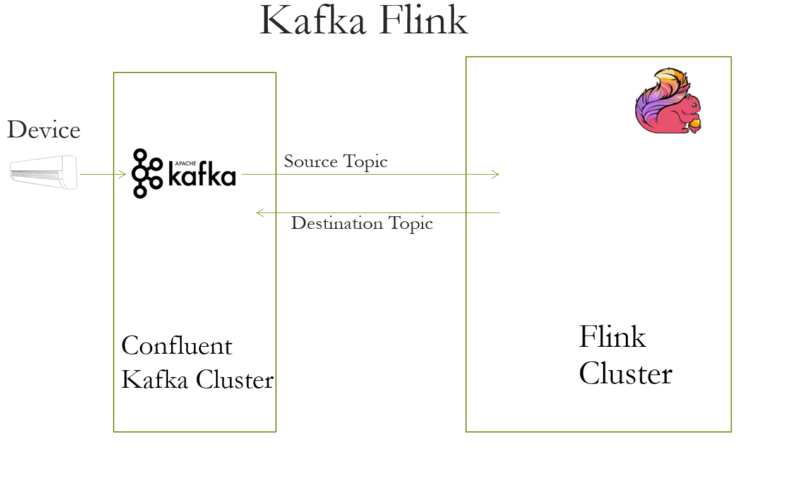

# Kafka Temperature Analytics
Alternate approach to Kstreams using flink. The temperature status is calculated using predefined values. The key and value of the kafka is consumed and produced using custom serde.

[](https://github.com/appuv/KafkaTemperatureAnalyticsFlink/actions/workflows/codeql-analysis.yml)

[](https://github.com/appuv/KafkaTemperatureAnalyticsFlink/actions/workflows/maven.yml)

# Architecture:


## Prerequisite
1. [Java 17](https://www.azul.com/downloads/?version=java-17-lts&package=jdk)
2. [Docker](https://www.docker.com/)   
3. [Confluent Kafka 6.2.0](https://docs.confluent.io/platform/current/quickstart/ce-docker-quickstart.html)
4. [Maven](https://maven.apache.org/)
5. [Flink](https://flink.apache.org/)

## Getting Started
To run the application,
Build the maven project

```
mvn clean install  
```

## Run the project
Submit the application to the  flink cluster.
The docker file with embedded flink cluster and kafka broker is provided in resources/docker.
It can be started via
```
docker-compose up -d
```

Create dummy data by [Datagen](https://github.com/appuv/KafkaDataGen) or by console producer as below

```
kafka-console-producer.bat --bootstrap-server localhost:9092 --topic flink_source --property "parse.key=true" --property "key.separator=|"
{"serial" : "1"}|{"serial":"1","owner":"appu","temp":"25","location":"earth"}  //normal
{"serial" : "1"}|{"serial":"1","owner":"appu","temp":"66","location":"earth"}  //hot
{"serial" : "1"}|{"serial":"1","owner":"appu","temp":"-4","location":"earth"} //cold
{"serial" : "1"}|{"serial":"1","owner":"appu","temp":"99","location":"earth"} //invalid
```

The output can be observed by consuming the destination topic
```
kafka-console-consumer.bat --bootstrap-server localhost:9092 --topic flink_destination --property print.key=true
```


